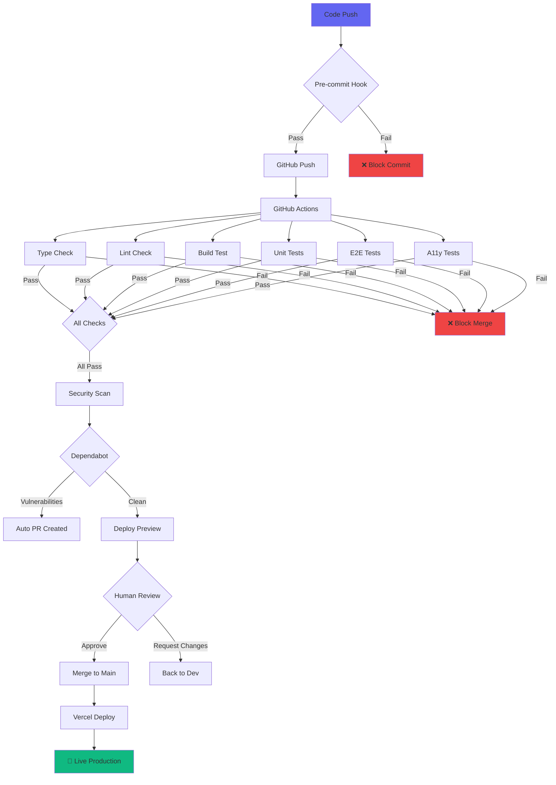
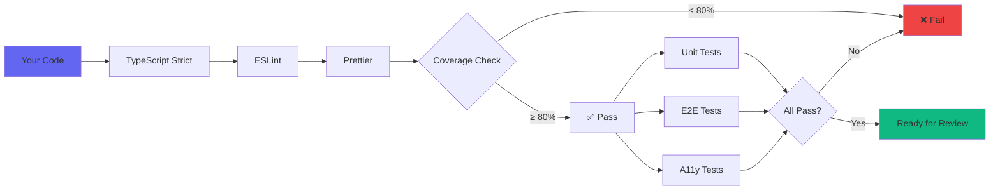
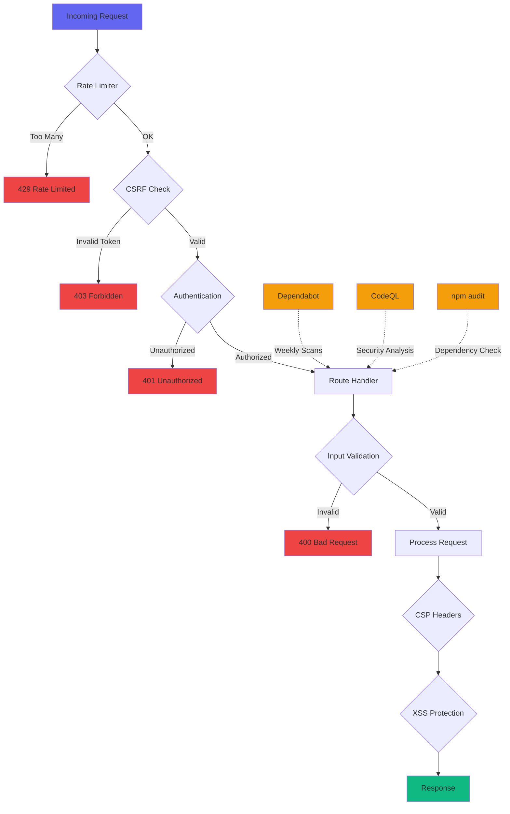
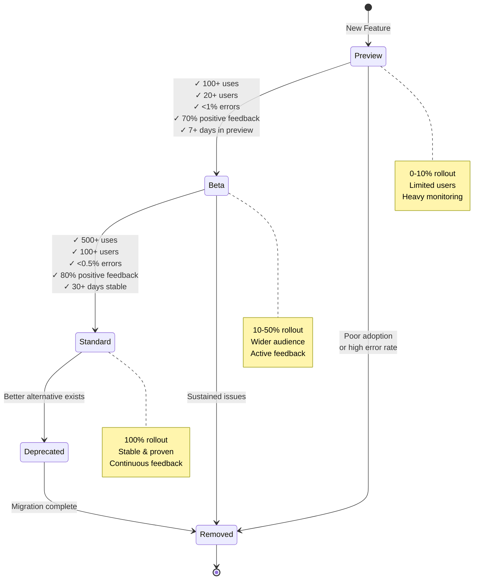

# 🧪 What if AI could build and evolve apps autonomously?

**Where Community Ideas Meet AI-Powered Development**

> An open experiment in building software the new way: You describe the problem, AI builds the solution, we ship it live.

[](https://unconference.io)
[](../../issues/new?template=tool-request.yml)
[](AGENTS.md)

---

## 🌟 The Experiment

**This is a living laboratory** where we're answering a fascinating question: *Can we build production software by describing what we want in plain English?*

### What Makes This Different

**Traditional approach:**
1. User requests feature
2. Developer reads request
3. Developer writes code
4. Deploy (weeks later)

**Our approach:**
1. User requests feature → AI analyzes it
2. AI writes code with proper guardrails → AI tests it
3. AI deploys → You use it (hours later)

**The result?** Real tools solving real problems at unprecedented speed, while maintaining quality through automated testing, security scanning, and AI-powered code review.

---

## 🎯 What You Get

**[unconference.io](https://unconference.io)** - Simple, focused tools for event organizers. No enterprise bloat, no feature creep, just tools that work.

### The Philosophy

✅ **We Build:**
- Tools community actually requests
- Features validated by real problems
- Simple solutions that "just work"
- Everything with AI assistance + human oversight

---

## 🤖 How AI Builds Your Ideas

When you submit a feature request, here's what happens:

### 1️⃣ **AI Triage** (Seconds)
Our GitHub Actions workflow uses AI to:
- Analyze your request for clarity and completeness
- Check if it duplicates existing features
- Assess value for organizers AND participants
- Flag potential security or scope issues

### 2️⃣ **AI Development** (Minutes to Hours)
If approved, Claude (our AI partner) gets to work:
- Reads the entire codebase context
- Writes TypeScript/Svelte code following our patterns
- Creates comprehensive tests (unit + E2E)
- Ensures accessibility (WCAG AA)
- Adds proper error handling and security

### 3️⃣ **Automated Validation** (Minutes)
Every change goes through:
```
✓ Type checking
✓ Linting  
✓ Unit tests (80% coverage minimum)
✓ E2E tests (Playwright)
✓ Accessibility tests (axe-core)
✓ Security scanning
✓ Build verification
```

### 4️⃣ **Human Review** (When Needed)
Humans step in for:
- Breaking changes
- Security concerns
- UX decisions
- Final deployment approval

### 5️⃣ **Live in Production** 🎉
Your feature is live at [unconference.io](https://unconference.io)

---

## �️ Quality Controls & Security (The Full Picture)

**It's not just about writing code** - see all the automated guardrails that ensure quality and security:

### CI/CD Pipeline Flow



### Code Quality Gates



### Security Layers



### Feature Flag Rollout Strategy



### What This Means

**Every change goes through:**
- ✅ **6 automated quality checks** before merge
- ✅ **4 security layers** on every request
- ✅ **Gradual rollout** via feature flags
- ✅ **Continuous monitoring** for errors
- ✅ **Automated dependency updates** (Dependabot)
- ✅ **Advanced security scanning** (CodeQL, npm audit)

**Result:** AI writes code fast, automation ensures it's production-ready.

---

## �🛠️ Available Tools

Each tool is connected to an **Event** - create an event, invite participants, then use the tools.

| Tool | Description | Status |
|------|-------------|--------|
| 🎲 **Team Shuffler** | Randomly assign participants to groups | ✅ Live |
| ⏱️ **Session Timer** | Full-screen countdown for talks (shareable) | ✅ Live |
| 🗳️ **Quick Poll** | Live voting for participants | ✅ Live |
| 📱 **QR Check-In** | Scan to join events | 🚧 Coming |

---

## 🚀 Quick Start

### For Event Organizers

1. Go to **[unconference.io](https://unconference.io)** → **Create Event**
2. Share the **event code** with participants
3. Enable the tools you need
4. Run your event!

### For Participants

1. Get the event code from your organizer
2. Go to **[unconference.io](https://unconference.io)** → **Join Event**
3. Enter the code
4. Use the tools!

---

## 💡 Request a Tool (Seriously, Try It!)

This isn't just open source - **it's a living experiment in AI-powered development.**

**[📬 Request a Tool](../../issues/new?template=tool-request.yml)** ← Click and watch AI build it

### The Magic Behind the Scenes

When you click that button, you trigger an entire AI-powered workflow:

1. **Your idea** → Issue template with smart prompts
2. **AI analyzes** → Checks for duplicates, scope, value
3. **Community votes** → 👍 on issues you want
4. **AI builds** → Code, tests, docs in one go
5. **You use it** → Live at unconference.io

### What Makes a Great Request?

✅ **Good Example:**
```
"Need a way to randomly split 50 participants into 
10 breakout rooms. Currently using a spreadsheet 
which takes 5 minutes each time."
```
Why it's good: Clear problem, specific use case, quantified pain

❌ **Unclear Example:**  
```
"Add better team features"
```
Why it's weak: Vague, no context, no specific problem

### Our AI Evaluation Criteria

The AI checks every request for:
- **Problem clarity** - Can we understand the pain?
- **User value** - Does it help organizers AND participants?
- **Scope** - Can it fit in a simple tool?
- **Uniqueness** - Is there already a free solution?
- **Feasibility** - Can we build it with our stack?

### Automatic Responses

You'll get instant feedback:
- ✅ **"Accepted for Review"** - Looks promising!
- 🤔 **"Need More Details"** - AI needs clarification
- ℹ️ **"Already Exists!"** - Check out our existing tool
- 🚫 **"Out of Scope"** - Doesn't fit our mission

---

## 🔬 The Tech Stack (Built for AI)

We chose technologies that AI understands deeply:

### Frontend
- **SvelteKit 2** with **Svelte 5 (runes)** - Modern, reactive
- **TypeScript (strict)** - Type safety helps AI catch errors
- **Tailwind CSS** - Utility-first styling AI can compose
- **Socket.io** - Real-time WebSocket connections

### Backend
- **SvelteKit API routes** - Server-side TypeScript
- **Auth.js** - Authentication (guest + OAuth)
- **JSON file storage** - Intentionally simple (no DB complexity)
- **Vercel** - Edge deployment

### AI Guardrails
- **Vitest** - Unit tests (80% coverage enforced)
- **Playwright** - E2E tests for user flows
- **Axe-core** - Accessibility testing (WCAG AA)
- **ESLint + TypeScript** - Code quality
- **Pre-commit hooks** - Local validation

### Why These Choices?

**For AI agents:**
- Well-documented frameworks AI can reference
- Patterns that AI can consistently replicate
- Strong typing catches AI mistakes
- Comprehensive testing validates AI output

**For developers:**
- Modern, productive tooling
- Fast feedback loops
- Easy to understand
- Simple to maintain

---

## 🔧 Development (Join the Experiment!)

Want to see AI-assisted development in action? Set up your own environment.

### Prerequisites

- **Node.js 18+** and **npm**
- **An AI coding assistant** (GitHub Copilot, Claude Code, etc.)
- **Curiosity** about the future of software development

### Quick Setup

```bash
git clone https://github.com/dmgrok/unconf.git
cd unconf
npm install

# Copy AI agent instructions (makes AI context-aware)
# These files teach AI about our architecture
ls AGENTS.md CLAUDE.md .github/copilot-instructions.md

# Install pre-commit hook
cp .github/hooks/pre-commit .git/hooks/pre-commit
chmod +x .git/hooks/pre-commit

# Start developing
npm run dev
```

### Test Like CI Before You Commit

```bash
# Quick checks (30 seconds) - great for rapid iteration
npm run pre-commit:quick

# Full validation (2-3 min) - before pushing
npm run pre-commit
```

### Key Files for AI Context

```
AGENTS.md                        # Universal AI agent instructions
CLAUDE.md                        # Claude-specific workflows  
.github/copilot-instructions.md  # GitHub Copilot context
.github/FUNCTIONALITY_MANIFEST.json  # What exists, what doesn't
```

**Pro tip:** Point your AI assistant at these files. They contain:
- Architecture patterns to follow
- Testing requirements  
- Security guidelines
- Common pitfalls to avoid

---

## 📐 Architecture (Designed for AI Understanding)

### The Structure AI Sees

```
src/
├── lib/
│   ├── types/tools.ts           # 🎯 Core type definitions
│   ├── stores/auth.ts           # 🔐 Authentication state
│   ├── security/                # 🛡️ Rate limiting, CSRF, CSP
│   ├── websocket/               # 🔌 Real-time connections
│   └── feature-flags/           # 🚩 GrowthBook integration
│
├── routes/
│   ├── create/                  # Create event flow
│   ├── join/                    # Join event flow
│   ├── events/[eventId]/        # Event hub
│   │   └── tools/               # Event-connected tools
│   │       ├── shuffler/
│   │       ├── timer/
│   │       └── poll/
│   └── api/                     # REST endpoints (+server.ts)
│
└── components/                  # Shared UI components
```

### Design Principles AI Follows

1. **Event-Connected Tools** - Every tool works within event context
2. **Shared Participant Context** - Tools know about event attendees
3. **File-Based Storage** - JSON files, not databases (intentional simplicity)
4. **Security First** - Rate limiting, CSRF, CSP on every route
5. **Accessibility Always** - WCAG AA compliance enforced

### How Data Flows

```
User Request → Triage (AI) → Development (AI) → Tests (Automated)
     ↓              ↓              ↓                 ↓
  GitHub        Issue Labels    Git Branch      CI Pipeline
     ↓              ↓              ↓                 ↓
Community → Human Review →     Merge    →    Production
```

---

## 🤝 Contributing (Humans + AI Welcome!)

### For Humans

1. **Request a tool** - [Open an issue](../../issues/new?template=tool-request.yml)
2. **Report bugs** - [Bug report](../../issues/new?template=bug-report.yml)  
3. **Suggest improvements** - [Enhancement](../../issues/new?template=improvement.yml)
4. **Vote on requests** - 👍 issues you want

### For AI Agents

If you're an AI agent working on this codebase:

1. **Read** [AGENTS.md](AGENTS.md) - Your instruction manual
2. **Consult** [FUNCTIONALITY_MANIFEST.json](.github/FUNCTIONALITY_MANIFEST.json) - What exists
3. **Follow** patterns in existing code
4. **Write tests** - 80% coverage minimum, both unit + E2E
5. **Update docs** - Keep CHANGELOG.md current

**Critical:** Always check the manifest before implementing features. Avoid duplicating existing functionality.---

## 📚 Documentation (Context for Everyone)

### For Users
| Document | What You'll Learn |
|----------|-------------------|
| [unconference.io](https://unconference.io) | Try the tools live |
| [Tool Request Template](../../issues/new?template=tool-request.yml) | How to request features |

### For Developers
| Document | What You'll Learn |
|----------|-------------------|
| [AGENTS.md](AGENTS.md) | AI agent instructions & patterns |
| [CLAUDE.md](CLAUDE.md) | Claude Code workflows |
| [.github/copilot-instructions.md](.github/copilot-instructions.md) | GitHub Copilot context |
| [TESTING.md](TESTING.md) | Testing philosophy & tools |
| [CONTRIBUTING.md](docs/CONTRIBUTING.md) | Development guidelines |

### For AI Agents
| Document | What You Need |
|----------|---------------|
| [FUNCTIONALITY_MANIFEST.json](.github/FUNCTIONALITY_MANIFEST.json) | **START HERE** - What exists, limitations, scope |
| [AGENTS.md](AGENTS.md) | Coding standards, patterns, requirements |
| [DESIGN_SYSTEM.md](docs/DESIGN_SYSTEM.md) | UI/UX guidelines |

### System Docs
| Document | Purpose |
|----------|---------|
| [CHANGELOG.md](CHANGELOG.md) | Version history |
| [PRE_COMMIT_TESTING.md](docs/PRE_COMMIT_TESTING.md) | Local CI validation |

---

## 🎓 Learn from This Project

### What You Can Study

**AI-Assisted Development:**
- Issue triage automation with AI
- Automated code generation patterns
- AI-powered testing strategies
- Human-in-the-loop workflows

**Modern Web Stack:**
- SvelteKit 2 + Svelte 5 (runes)
- Real-time WebSocket with Socket.io
- Authentication with Auth.js
- Feature flags with GrowthBook

**Software Quality:**
- Trunk-based development
- Comprehensive testing (unit + E2E + a11y)
- Security best practices
- Accessibility compliance

**Community-Driven Product:**
- Issue templates that work
- AI-powered triage
- Feature flag gradual rollouts
- Feedback collection

---

## 🌈 The Vision

**We're proving something important:**

> With the right guardrails, AI can build production software from natural language descriptions.

This isn't about replacing developers - it's about **augmenting human intent**. You understand the problem, AI handles the implementation details, automation ensures quality.

**The future we're building:**
- Ideas → Production in hours, not weeks
- Quality maintained through automation
- Humans focus on product decisions
- AI handles coding patterns

**Join the experiment.** Request a tool, watch it get built, use it in production. This is software development's new frontier.

---

## 📜 License

MIT

---

*Built with SvelteKit • Live at [unconference.io](https://unconference.io) • AI-assisted by Claude*
